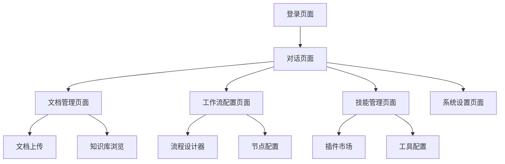

## 1. 产品概述
基于LangChain框架构建智能对话式Web应用，集成RAG检索增强生成、PDF文档处理、网络搜索和工作流引擎，为用户提供企业级知识问答解决方案。

目标用户：企业知识管理专员、客服团队、研究人员和需要构建智能问答系统的组织。

## 2. 核心功能

### 2.1 用户角色
| 角色 | 注册方式 | 核心权限 |
|------|----------|----------|
| 用户 | 用户名+密码注册 | 上传文档、发起对话、查看自己的历史记录 |

**数据隔离原则**：每个用户只能访问自己的数据，包括聊天记录、上传的文档和个人配置，确保严格的用户数据隔离。

### 2.2 功能模块
应用包含以下核心页面：
1. **对话页面**：智能问答界面、消息历史、上下文管理
2. **文档管理页面**：PDF上传、解析状态、知识库管理
3. **工作流配置页面**：流程设计器、节点配置、条件设置
4. **技能管理页面**：插件安装、工具配置、权限管理
5. **系统设置页面**：模型配置、搜索API设置、性能监控

### 2.3 页面详情
| 页面名称 | 模块名称 | 功能描述 |
|----------|----------|----------|
| 对话页面 | 消息输入区 | 支持多轮对话输入、文件附件、语音转文字 |
| 对话页面 | 回答展示区 | 显示AI回答、引用来源、相关文档推荐 |
| 对话页面 | 历史记录 | 按时间排序的对话历史、搜索和筛选功能 |
| 文档管理页面 | 文档上传 | 拖拽上传PDF、批量处理、格式验证 |
| 文档管理页面 | 解析进度 | 实时显示文档解析状态、分块信息、向量化进度 |
| 文档管理页面 | 知识库浏览 | 文档分类、标签管理、内容预览 |
| 工作流配置页面 | 流程设计器 | 可视化拖拽界面、节点库、连接线配置 |
| 工作流配置页面 | 节点配置 | LLM参数设置、条件判断、数据处理节点 |
| 技能管理页面 | 插件市场 | 浏览可用技能、安装卸载、版本管理 |
| 技能管理页面 | 工具配置 | API密钥管理、参数映射、权限设置 |
| 系统设置页面 | 模型配置 | LLM提供商选择、模型参数调优、速率限制 |
| 系统设置页面 | 性能监控 | 响应时间统计、并发量监控、错误日志 |

## 3. 核心流程

### 用户对话流程
1. 用户注册（用户名+密码），注册成功后立即可使用系统
2. 进入对话页面，选择对话模式（普通问答/RAG增强/网络搜索）
3. 输入问题，系统自动检测是否需要检索文档
4. 如需检索，执行向量搜索获取用户自己的相关文档片段
5. 结合上下文和检索结果，调用LLM生成回答
6. 显示回答并标注引用来源，支持追问和澄清

**重要**：所有数据严格按用户隔离，用户只能看到自己的聊天记录和上传的文档

### 文档处理流程
1. 用户上传PDF文档，系统进行格式验证
2. 启动文档解析服务，提取文本内容和结构
3. 按配置规则进行文本分块，保持语义完整性
4. 调用向量化服务，将文本块转换为向量表示
5. 存储到向量数据库，建立索引和元数据
6. 更新知识库状态，通知用户处理完成

### 工作流执行流程
1. 管理员设计对话工作流，配置节点和条件
2. 用户发起对话，系统加载对应工作流配置
3. 按流程定义执行各个节点，收集中间结果
4. 根据条件判断选择不同执行路径
5. 整合所有节点输出，生成最终回答
6. 记录执行日志，支持调试和优化

## 4. 用户界面设计

### 4.1 设计风格
- **主色调**：深蓝色(#1E40AF)作为主色，灰色(#6B7280)作为辅色
- **按钮样式**：圆角设计，主要操作为实心按钮，次要操作为边框按钮
- **字体选择**：中文使用思源黑体，英文使用Inter，正文字号14px
- **布局风格**：左侧导航+右侧内容区，卡片式信息展示
- **图标风格**：使用线性图标，保持简洁一致的视觉风格

### 4.2 页面设计概述
| 页面名称 | 模块名称 | UI元素 |
|----------|----------|--------|
| 对话页面 | 消息输入区 | 底部固定输入框，支持多行文本和文件拖拽，发送按钮为蓝色圆形 |
| 对话页面 | 回答展示区 | 气泡式消息布局，用户消息右对齐蓝色背景，AI消息左对齐白色背景 |
| 对话页面 | 历史记录 | 左侧边栏抽屉式设计，按日期分组显示，支持关键词搜索 |
| 文档管理页面 | 文档上传 | 中央拖拽区域，虚线边框，上传进度条显示在卡片底部 |
| 文档管理页面 | 解析进度 | 实时进度条，状态图标（处理中/成功/失败），预计剩余时间 |
| 工作流配置页面 | 流程设计器 | 画布式界面，左侧节点库面板，顶部工具栏，支持缩放和拖拽 |

### 4.3 响应式设计
- 桌面端优先设计，支持1920x1080标准分辨率
- 平板端适配：768px以上保持完整功能，调整布局密度
- 移动端简化：仅保留核心对话功能，文档管理转为列表视图
- 触摸优化：按钮最小44px点击区域，支持手势操作

### 4.4 3D场景指导
本应用不涉及3D内容展示，主要专注于2D界面交互和数据可视化。