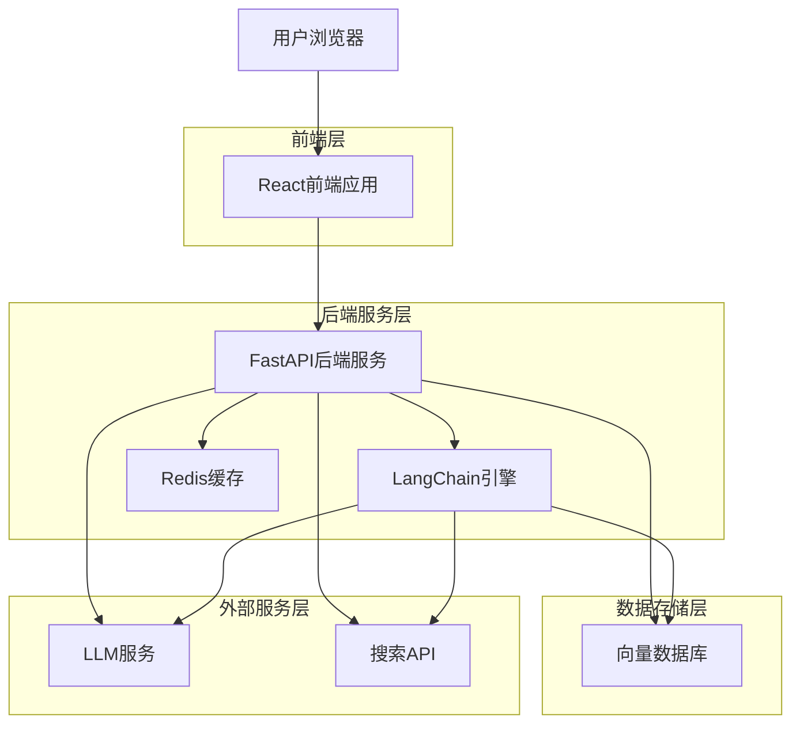
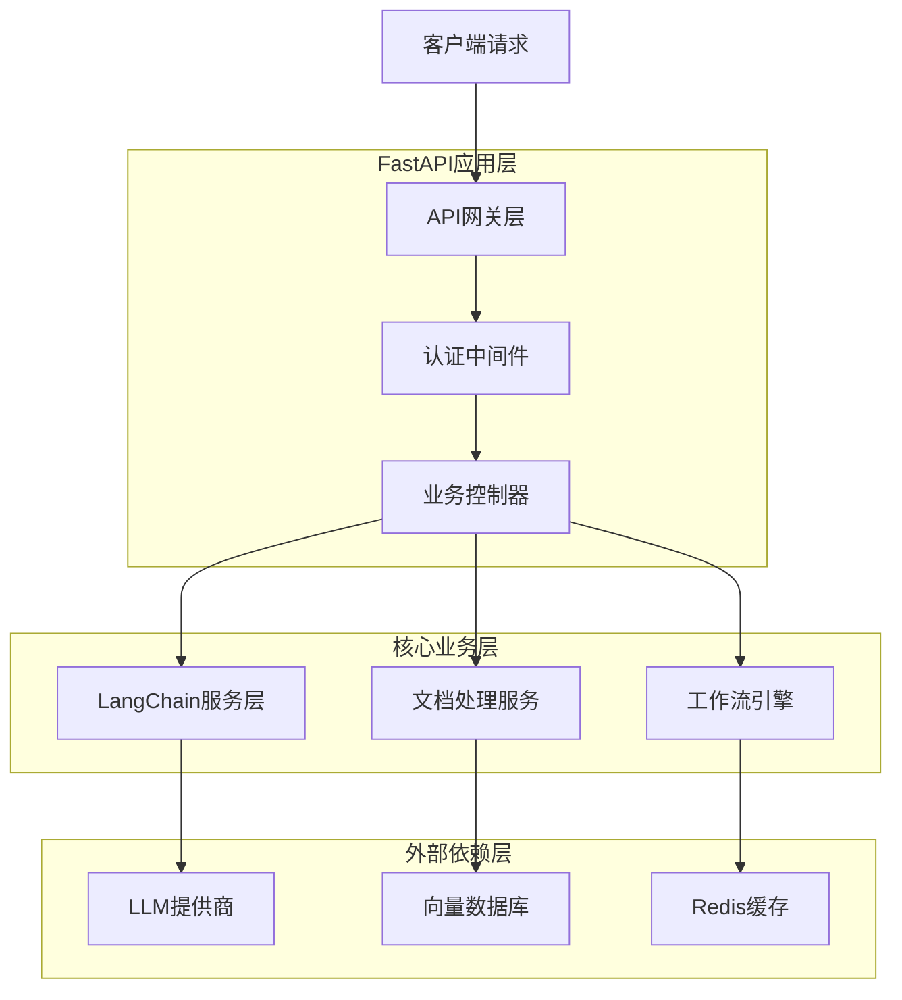
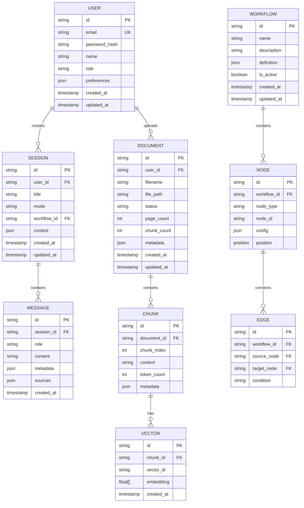

## 1. 架构设计



## 2. 技术描述

- **前端**: React@18 + TypeScript@5 + TailwindCSS@3 + Vite
- **初始化工具**: vite-init
- **后端**: Python@3.11 + FastAPI@0.104 + LangChain@0.1
- **向量数据库**: ChromaDB@0.4（本地部署）/ Pinecone（云服务）
- **缓存**: Redis@7（会话管理和缓存）
- **文件存储**: 本地文件系统/S3兼容存储
- **LLM集成**: 
  - 国际模型：OpenAI GPT-4/GPT-3.5, Claude
  - 国内模型：通义千问(Qwen)、豆包(Doubao)
  - 本地模型：ChatGLM、Baichuan等开源模型
- **搜索引擎**: SerpAPI@2 / Bing Search API

## 3. 路由定义

| 路由 | 用途 |
|------|------|
| / | 主页，重定向到对话页面 |
| /chat | 对话页面，主要交互界面 |
| /documents | 文档管理页面，上传和管理知识库 |
| /workflows | 工作流配置页面，设计对话流程 |
| /skills | 技能管理页面，插件和工具配置 |
| /settings | 系统设置页面，模型和API配置 |
| /login | 用户登录页面 |
| /register | 用户注册页面 |
| /api/docs | API文档页面（Swagger UI） |

## 4. API定义

### 4.1 对话API

**创建对话会话**
```
POST /api/chat/sessions
```

请求参数：
| 参数名 | 参数类型 | 必需 | 描述 |
|--------|----------|------|------|
| title | string | false | 会话标题 |
| mode | string | true | 对话模式: rag, search, normal |
| workflow_id | string | false | 工作流ID |

响应：
```json
{
  "session_id": "uuid",
  "title": "新对话",
  "created_at": "2024-01-01T00:00:00Z"
}
```

**发送消息**
```
POST /api/chat/messages
```

请求参数：
| 参数名 | 参数类型 | 必需 | 描述 |
|--------|----------|------|------|
| session_id | string | true | 会话ID |
| content | string | true | 消息内容 |
| attachments | array | false | 附件列表 |
| context_docs | array | false | 上下文文档ID列表 |

**获取回答**
```
GET /api/chat/messages/{message_id}/response
```

响应流：
```json
{
  "type": "stream",
  "content": "回答内容",
  "sources": [...],
  "status": "processing|completed|error"
}
```

### 4.2 文档API

**上传文档**
```
POST /api/documents/upload
```

请求参数：
| 参数名 | 参数类型 | 必需 | 描述 |
|--------|----------|------|------|
| file | file | true | PDF文件 |
| category | string | false | 文档分类 |
| tags | array | false | 标签列表 |
| chunk_size | integer | false | 分块大小，默认512 |
| chunk_overlap | integer | false | 重叠大小，默认50 |

**查询文档状态**
```
GET /api/documents/{document_id}/status
```

响应：
```json
{
  "document_id": "uuid",
  "status": "processing|completed|failed",
  "progress": 75,
  "chunks_count": 128,
  "error_message": null
}
```

**搜索文档**
```
POST /api/documents/search
```

请求参数：
| 参数名 | 参数类型 | 必需 | 描述 |
|--------|----------|------|------|
| query | string | true | 搜索查询 |
| top_k | integer | false | 返回结果数量，默认10 |
| threshold | float | false | 相似度阈值，默认0.7 |
| filters | object | false | 过滤条件 |

### 4.3 模型配置API

**获取支持的LLM模型列表**
```
GET /api/models
```

响应：
```json
{
  "models": [
    {
      "id": "qwen-turbo",
      "name": "通义千问-Turbo",
      "provider": "aliyun",
      "type": "domestic",
      "supported_modes": ["chat", "completion"]
    },
    {
      "id": "doubao-pro",
      "name": "豆包-Pro",
      "provider": "bytedance",
      "type": "domestic", 
      "supported_modes": ["chat", "completion"]
    },
    {
      "id": "gpt-4",
      "name": "GPT-4",
      "provider": "openai",
      "type": "international",
      "supported_modes": ["chat", "completion"]
    }
  ]
}
```

**配置模型API密钥**
```
POST /api/models/config
```

请求参数：
| 参数名 | 参数类型 | 必需 | 描述 |
|--------|----------|------|------|
| provider | string | true | 提供商: aliyun, bytedance, openai |
| api_key | string | true | API密钥 |
| endpoint | string | false | 自定义端点（可选） |
| model_id | string | false | 指定模型ID（可选） |

### 4.4 工作流API

**创建工作流**
```
POST /api/workflows
```

请求参数：
| 参数名 | 参数类型 | 必需 | 描述 |
|--------|----------|------|------|
| name | string | true | 工作流名称 |
| description | string | false | 描述信息 |
| nodes | array | true | 节点定义 |
| edges | array | true | 连接定义 |
| variables | object | false | 变量定义 |

**执行工作流**
```
POST /api/workflows/{workflow_id}/execute
```

## 5. 服务器架构图



## 6. 数据模型

### 6.1 数据模型定义



### 6.2 数据定义语言

**用户表 (users)**
```sql
CREATE TABLE users (
    id UUID PRIMARY KEY DEFAULT gen_random_uuid(),
    username VARCHAR(50) UNIQUE NOT NULL,
    password_hash VARCHAR(255) NOT NULL,
    created_at TIMESTAMP WITH TIME ZONE DEFAULT NOW(),
    updated_at TIMESTAMP WITH TIME ZONE DEFAULT NOW()
);

CREATE INDEX idx_users_username ON users(username);
```

**数据隔离策略**：
- 所有数据表都包含 `user_id` 字段，确保用户只能访问自己的数据
- 数据库层面使用 RLS (Row Level Security) 策略
- 应用层面在查询时自动添加用户过滤条件

**会话表 (sessions)**
```sql
CREATE TABLE sessions (
    id UUID PRIMARY KEY DEFAULT gen_random_uuid(),
    user_id UUID NOT NULL REFERENCES users(id) ON DELETE CASCADE,
    title VARCHAR(255) NOT NULL,
    mode VARCHAR(20) DEFAULT 'normal' CHECK (mode IN ('normal', 'rag', 'search')),
    workflow_id UUID,
    context JSONB DEFAULT '{}',
    created_at TIMESTAMP WITH TIME ZONE DEFAULT NOW(),
    updated_at TIMESTAMP WITH TIME ZONE DEFAULT NOW()
);

CREATE INDEX idx_sessions_user_id ON sessions(user_id);
CREATE INDEX idx_sessions_created_at ON sessions(created_at DESC);
```

**消息表 (messages)**
```sql
CREATE TABLE messages (
    id UUID PRIMARY KEY DEFAULT gen_random_uuid(),
    session_id UUID NOT NULL REFERENCES sessions(id) ON DELETE CASCADE,
    role VARCHAR(20) NOT NULL CHECK (role IN ('user', 'assistant', 'system')),
    content TEXT NOT NULL,
    metadata JSONB DEFAULT '{}',
    sources JSONB DEFAULT '[]',
    created_at TIMESTAMP WITH TIME ZONE DEFAULT NOW()
);

CREATE INDEX idx_messages_session_id ON messages(session_id);
CREATE INDEX idx_messages_created_at ON messages(created_at DESC);
```

**文档表 (documents)**
```sql
CREATE TABLE documents (
    id UUID PRIMARY KEY DEFAULT gen_random_uuid(),
    user_id UUID NOT NULL REFERENCES users(id) ON DELETE CASCADE,
    filename VARCHAR(255) NOT NULL,
    file_path TEXT NOT NULL,
    status VARCHAR(20) DEFAULT 'processing' CHECK (status IN ('processing', 'completed', 'failed')),
    page_count INTEGER DEFAULT 0,
    chunk_count INTEGER DEFAULT 0,
    metadata JSONB DEFAULT '{}',
    error_message TEXT,
    created_at TIMESTAMP WITH TIME ZONE DEFAULT NOW(),
    updated_at TIMESTAMP WITH TIME ZONE DEFAULT NOW()
);

CREATE INDEX idx_documents_user_id ON documents(user_id);
CREATE INDEX idx_documents_status ON documents(status);
CREATE INDEX idx_documents_created_at ON documents(created_at DESC);
```

**数据隔离策略 (RLS - Row Level Security)**
```sql
-- 启用RLS
ALTER TABLE users ENABLE ROW LEVEL SECURITY;
ALTER TABLE sessions ENABLE ROW LEVEL SECURITY;
ALTER TABLE messages ENABLE ROW LEVEL SECURITY;
ALTER TABLE documents ENABLE ROW LEVEL SECURITY;
ALTER TABLE chunks ENABLE ROW LEVEL SECURITY;

-- 创建策略：用户只能查看自己的数据
CREATE POLICY "用户只能查看自己的用户信息" ON users
    FOR ALL USING (id = auth.uid());

CREATE POLICY "用户只能查看自己的会话" ON sessions
    FOR ALL USING (user_id = auth.uid());

CREATE POLICY "用户只能查看自己的消息" ON messages
    FOR ALL USING (session_id IN (SELECT id FROM sessions WHERE user_id = auth.uid()));

CREATE POLICY "用户只能查看自己的文档" ON documents
    FOR ALL USING (user_id = auth.uid());

CREATE POLICY "用户只能查看自己的文档分块" ON chunks
    FOR ALL USING (document_id IN (SELECT id FROM documents WHERE user_id = auth.uid()));

-- 授权策略
GRANT SELECT ON users TO authenticated;
GRANT ALL ON sessions TO authenticated;
GRANT ALL ON messages TO authenticated;
GRANT ALL ON documents TO authenticated;
GRANT ALL ON chunks TO authenticated;
```

**文档分块表 (chunks)**
```sql
CREATE TABLE chunks (
    id UUID PRIMARY KEY DEFAULT gen_random_uuid(),
    document_id UUID NOT NULL REFERENCES documents(id) ON DELETE CASCADE,
    chunk_index INTEGER NOT NULL,
    content TEXT NOT NULL,
    token_count INTEGER NOT NULL,
    metadata JSONB DEFAULT '{}',
    created_at TIMESTAMP WITH TIME ZONE DEFAULT NOW()
);

CREATE INDEX idx_chunks_document_id ON chunks(document_id);
CREATE INDEX idx_chunks_chunk_index ON chunks(document_id, chunk_index);
```

**工作流表 (workflows)**
```sql
CREATE TABLE workflows (
    id UUID PRIMARY KEY DEFAULT gen_random_uuid(),
    name VARCHAR(255) NOT NULL,
    description TEXT,
    definition JSONB NOT NULL,
    is_active BOOLEAN DEFAULT true,
    created_at TIMESTAMP WITH TIME ZONE DEFAULT NOW(),
    updated_at TIMESTAMP WITH TIME ZONE DEFAULT NOW()
);

CREATE INDEX idx_workflows_is_active ON workflows(is_active);
```

**向量存储配置**
```python
# ChromaDB集合配置
chroma_collection_config = {
    "collection_name": "document_embeddings",
    "embedding_function": "sentence-transformers/all-mpnet-base-v2",
    "distance_metric": "cosine",
    "metadata_schema": {
        "document_id": "string",
        "chunk_id": "string",
        "chunk_index": "integer",
        "content_type": "string"
    }
}

# 向量索引配置
vector_index_config = {
    "index_type": "hnsw",
    "metric_type": "cosine",
    "params": {
        "M": 16,
        "efConstruction": 200,
        "ef": 100
    }
}
```

**Redis缓存配置**
```
# 会话缓存
SESSION_CACHE_PREFIX = "session:"
SESSION_TTL = 3600  # 1小时

# 向量搜索结果缓存
VECTOR_CACHE_PREFIX = "vector:"
VECTOR_CACHE_TTL = 1800  # 30分钟

# LLM响应缓存
LLM_CACHE_PREFIX = "llm:"
LLM_CACHE_TTL = 7200  # 2小时
```